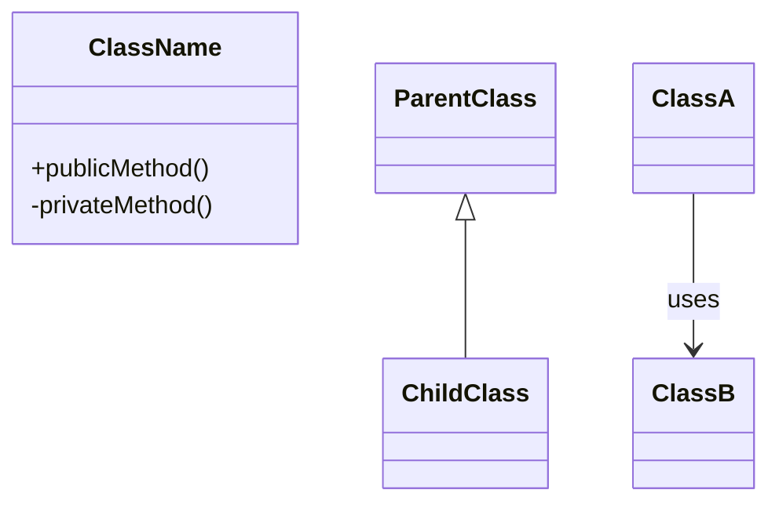

# /analyze - 코드 및 로그 분석

코드 구조 분석과 로그 진단을 수행합니다.

## Usage

```
/analyze <target> [args]

Targets:
  code [--comprehensive]   코드 구조 분석 (Mermaid 다이어그램)
  logs [path] [options]    로그 파일 분석 (에러 패턴, 병목)
```

---

## /analyze code - 코드 구조 분석

```bash
/analyze code                    # Mermaid classDiagram 생성
/analyze code --comprehensive    # 종합 분석 리포트
```

### 기본 모드 (Mermaid Diagram)

현재 로드된 파일을 분석하여 Mermaid.js classDiagram 생성:

1. Class/Module 구조
2. 상속 관계
3. 컴포넌트 간 의존성

**출력 형식**: Mermaid 코드 블록만 출력



### Rules (기본 모드)

**CRITICAL**: 기본 모드에서는 Mermaid 코드 블록만 출력합니다.

1. **NO TEXT OUTSIDE CODE BLOCK**: Only output the \`\`\`mermaid ... \`\`\` block
2. **NO EXPLANATIONS**: No "Here's the diagram" or "This shows..."
3. **NO MARKDOWN FORMATTING**: No headers, lists, or paragraphs before/after
4. **ACCURATE RELATIONSHIPS**: Use correct Mermaid syntax for relationship types
5. **FOCUSED SCOPE**: Include only essential classes/modules (max 10-15 nodes)
6. **CLEAR NAMING**: Use descriptive class/module names

### Anti-Patterns (기본 모드)

❌ "Here's the Mermaid diagram showing..."
❌ "The following classDiagram represents..."
❌ Adding explanatory text before/after diagram
❌ Using incorrect Mermaid syntax
❌ Including too many nodes (>20)

### Success Criteria (기본 모드)

✅ Output starts with exactly: \`\`\`mermaid
✅ Output ends with exactly: \`\`\`
✅ No text before opening \`\`\`
✅ No text after closing \`\`\`
✅ Valid Mermaid classDiagram syntax
✅ Relationships accurately reflect code structure

### --comprehensive 모드

종합 분석 리포트를 생성합니다:

#### Phase 1: Discovery & Inventory
- 전체 디렉토리 구조 스캔
- 파일 타입별 분류 (code, docs, config)
- README, CHANGELOG 등 문서 분석

#### Phase 2: Technical Analysis
- 아키텍처 패턴 식별 (MVC, microservices 등)
- 기술 스택 파악 (언어, 프레임워크, 버전)
- 코드 품질 및 테스트 커버리지

#### Phase 3: Context Understanding
- 비즈니스 로직 추출
- 주요 기능 및 API 매핑
- 외부 의존성 분석

#### Phase 4: Summary Output

```markdown
# 종합 분석 리포트

## Executive Summary
[2-3문장 핵심 요약]

## 기술 아키텍처
[구조 다이어그램]

## 주요 기능
- Feature 1
- Feature 2

## 의존성
- 내부: [모듈 관계]
- 외부: [라이브러리]

## 개선 권장사항
- [강점]
- [개선점]
- [리스크]
```

### Mermaid 관계 표현

| 관계 | 문법 | 의미 |
|------|------|------|
| 상속 | `Parent <\|-- Child` | Inheritance |
| 구성 | `Whole *-- Part` | Composition |
| 집합 | `Container o-- Item` | Aggregation |
| 연관 | `ClassA --> ClassB` | Association |
| 의존 | `ClassA ..> ClassB` | Dependency |
| 구현 | `Interface <\|.. Concrete` | Implementation |

---

## /analyze logs - 로그 분석

```bash
/analyze logs                        # 기본 로그 파일
/analyze logs logs/app.log           # 특정 파일
/analyze logs --recent 100           # 최근 100줄
/analyze logs --errors               # 에러만
```

### 연동 에이전트

| 영역 | 에이전트 | 역할 |
|------|----------|------|
| 문제 진단 | `devops-troubleshooter` | 로그 패턴 분석 |
| 근본 원인 | `debugger` | 에러 추적 |
| 성능 이슈 | `performance-engineer` | 병목 식별 |

### 분석 단계

#### Step 1: 로그 수집

```bash
# 최근 로그 조회
tail -n 1000 logs/app.log

# 에러 로그 필터링
grep -i "error\|exception\|failed" logs/app.log

# 시간 범위 필터
awk '/2025-01-20 10:00/,/2025-01-20 11:00/' logs/app.log
```

#### Step 2: 패턴 분석

| 패턴 | 의미 | 심각도 |
|------|------|--------|
| `ERROR` | 에러 발생 | HIGH |
| `WARN` | 경고 | MEDIUM |
| `Exception` | 예외 발생 | HIGH |
| `timeout` | 타임아웃 | MEDIUM |
| `connection refused` | 연결 실패 | HIGH |
| `OOM` | 메모리 부족 | CRITICAL |

#### Step 3: 에러 분류

```markdown
## 에러 분류 결과

### 빈도별 상위 에러

| 순위 | 에러 유형 | 발생 횟수 | 최근 발생 |
|------|-----------|-----------|-----------|
| 1 | DB Connection Timeout | 45 | 10:58 |
| 2 | NullPointerException | 12 | 10:45 |

### 시간대별 분포

10:00-10:15 ████░░░░░░ 15건
10:15-10:30 ████████░░ 32건 ← 피크
10:30-10:45 ██████░░░░ 22건
```

#### Step 4: 근본 원인 분석

```markdown
## 근본 원인 분석

### DB Connection Timeout (45건)

**스택 트레이스**:
java.sql.SQLException: Connection timed out
  at com.mysql.jdbc.ConnectionImpl.connect()

**원인 추정**:
1. DB 서버 과부하
2. 연결 풀 고갈
3. 네트워크 지연

**권장 조치**:
1. 연결 풀 크기 증가 (10 → 20)
2. 쿼리 최적화 검토
```

### 출력 형식

```markdown
## 로그 분석 보고서

### 요약
- **분석 기간**: 2025-01-20 10:00 ~ 11:00
- **총 로그 라인**: 5,432줄
- **에러 발생**: 65건
- **경고 발생**: 128건

### 주요 발견사항

1. **DB 연결 문제** (심각도: HIGH)
   - 10:15부터 타임아웃 급증
   - 연결 풀 고갈 의심

2. **API 레이트 리밋** (심각도: MEDIUM)
   - 외부 API 호출 제한 도달

### 권장 조치

| 우선순위 | 조치 | 담당 |
|----------|------|------|
| 1 | 연결 풀 크기 증가 | DevOps |
| 2 | 쿼리 최적화 | Backend |
```

---

## Related

- `/optimize` - 성능 최적화
- `/check` - 코드 품질 검사
- `/parallel review` - 병렬 코드 리뷰
