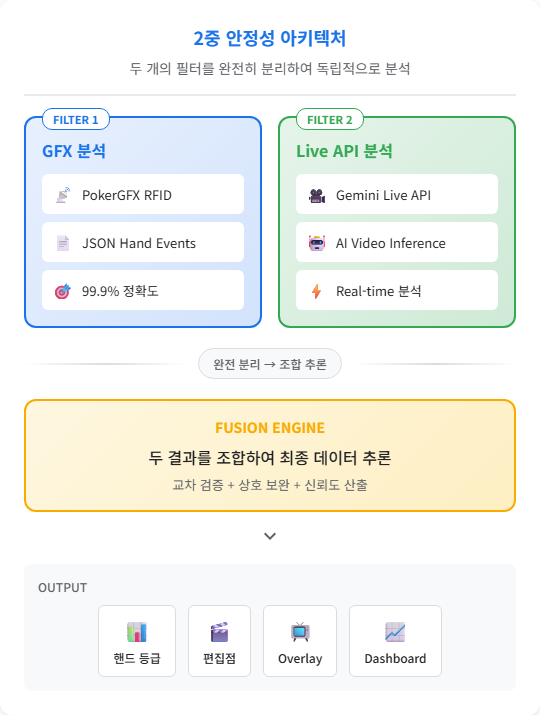
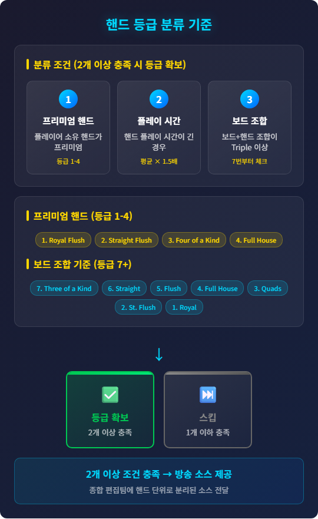

# Poker Hand Auto-Capture System

PokerGFX 기반 멀티테이블 포커 핸드 자동 캡처 및 분류 시스템

## 개요

포커 프로덕션 환경에서 여러 대의 피처 테이블에서 발생하는 핸드를 자동으로 감지, 분류, 기록하는 시스템입니다.

### 목적: 인력 자동화

**5명 → 1명 + AI** (80% 인력 절감)

| 역할 | 기존 | 향후 |
|------|------|------|
| 시트 관리 | 1명 | 1명 |
| 전체 모니터링 | 1명 | **AI** |
| 피처 테이블 A | 1명 | **AI** |
| 피처 테이블 B | 1명 | **AI** |
| 피처 테이블 C | 1명 | **AI** |

### 3단계 핸드 분류 프로세스

1. **1차**: GFX RFID JSON 파일로 핸드 분류
2. **2차**: Gemini Live API로 핸드 분류
3. **3차**: 1차+2차 결과를 AI가 분석하여 핸드 등급 및 편집 시작점 도출

### 활용 목적

피처 테이블을 **핸드 단위로 분리/캡처** → **등급 표기** → **종합 편집팀에 핸드 소스 제공**

### 주요 기능

- **핸드 시작/종료 자동 감지**: PokerGFX RFID 데이터 기반
- **핸드 등급 자동 분류**: Royal Flush ~ High Card (10단계)
- **2중 안정성 아키텍처**: Primary(PokerGFX) + Secondary(AI Video) 이중화
- **실시간 오버레이**: WebSocket 기반 방송용 그래픽
- **통계 저장**: Hand2Note 연동
- **클립 마킹**: EDL/FCPXML 편집점 자동 생성

## 아키텍처



## 설치

### 요구사항

- Python 3.11+
- PokerGFX 엔터프라이즈 라이선스
- 기존 장비 활용 (별도 GPU 불필요)

### 설치 방법

```bash
# 저장소 클론
git clone <repository-url>
cd automation_feature_table

# 의존성 설치
pip install -e ".[dev]"

# 환경 변수 설정
cp .env.example .env
# .env 파일 수정하여 API 키 설정
```

## 설정

### 환경 변수 (.env)

```env
# PokerGFX
POKERGFX_API_URL=ws://localhost:8080
POKERGFX_API_KEY=your_api_key

# Gemini API
GEMINI_API_KEY=your_gemini_api_key
GEMINI_MODEL=gemini-2.5-flash-native-audio-preview

# Video Streams (쉼표로 구분)
VIDEO_STREAMS=rtsp://table1:554/stream,rtsp://table2:554/stream

# Output
OVERLAY_WS_PORT=8081
CLIP_MARKERS_PATH=./output/markers
```

## 사용법

### 시스템 실행

```bash
python -m src.main
```

### 오버레이 연결

브라우저에서 `ws://localhost:8081`로 WebSocket 연결

### 출력 형식

#### 클립 마커

- **JSON**: 모든 핸드 정보 포함
- **EDL**: DaVinci Resolve, Premiere Pro 호환
- **FCPXML**: Final Cut Pro 호환

## 프로젝트 구조

```
automation_feature_table/
├── src/
│   ├── config/         # 설정 관리
│   ├── primary/        # PokerGFX 연동
│   ├── secondary/      # Gemini AI 연동
│   ├── fusion/         # 결과 융합 엔진
│   ├── output/         # 출력 (오버레이, 마커)
│   ├── models/         # 데이터 모델
│   └── main.py         # 메인 진입점
├── tests/              # 테스트
├── docs/               # 문서
│   └── checklists/     # 체크리스트
├── tasks/
│   └── prds/           # PRD 문서
├── pyproject.toml      # 프로젝트 설정
└── README.md
```

## 핸드 등급

| 등급 | 핸드 | 프리미엄 |
|------|------|----------|
| 1 | Royal Flush | O |
| 2 | Straight Flush | O |
| 3 | Four of a Kind | O |
| 4 | Full House | O |
| 5 | Flush | |
| 6 | Straight | |
| 7 | Three of a Kind | |
| 8 | Two Pair | |
| 9 | One Pair | |
| 10 | High Card | |

### 핸드 등급 분류 기준 (A~C)

**조건** (2개 이상 충족 시 등급 확보):

1. **프리미엄 핸드**: 플레이어 소유 핸드가 프리미엄 핸드(등급 1-4)인 경우
2. **플레이 시간**: 핸드 플레이 시간이 긴 경우
3. **보드 조합**: 보드 + 플레이 핸드 조합이 **Three of a Kind 이상**인 경우 (7번부터 프리미엄 체크)

**등급 기준**:

| 등급 | 조건 충족 | 방송 사용 |
|:----:|:--------:|:--------:|
| **A** | 3개 모두 | O |
| **B** | 2개 | O |
| **C** | 1개 | X |

> **B등급 이상부터 방송 사용 가능**



### 편집점 시작점 추론

기존 방송 분석을 통한 패턴 학습으로 편집 시작점 자동 추론

## 테스트

```bash
# 전체 테스트
pytest tests/ -v

# 커버리지 포함
pytest tests/ -v --cov=src
```

## 관련 문서

- [PRD-0001](tasks/prds/PRD-0001-poker-hand-auto-capture.md) - 프로젝트 요구사항
- [Checklist](docs/checklists/PRD-0001.md) - 구현 체크리스트

## 라이선스

MIT License
