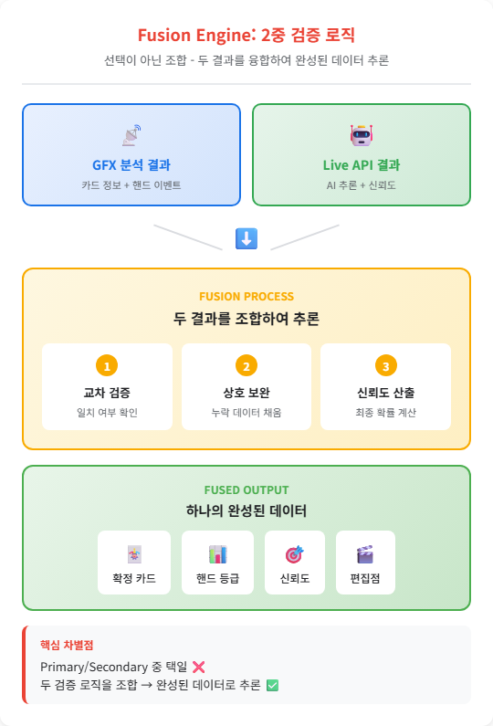

# PRD-0001: 포커 핸드 자동 캡처 및 분류 시스템

## 문서 정보

| 항목 | 내용 |
|------|------|
| **PRD ID** | PRD-0001 |
| **제목** | 포커 피처 테이블 핸드 자동 캡처 및 분류 시스템 |
| **버전** | 1.0 |
| **작성일** | 2025-12-23 |
| **상태** | Draft |

---

## 1. 개요

### 1.1 배경

PokerGFX.io 솔루션을 사용하는 포커 프로덕션 환경에서 여러 대의 피처 테이블(3-5대)에서 발생하는 핸드를 수동으로 모니터링하고 하이라이트를 선별하고 있습니다. 이를 효율적으로 소수의 인원이 관리할 수 있는 시스템으로 구축합니다.

#### 현재 인력 구조 (5명)

| 역할 | 인원 | 업무 |
|------|------|------|
| 시트 관리 | 1명 | 플레이어 시트 배정 및 관리 |
| 전체 모니터링 | 1명 | 모든 테이블 상황 모니터링 |
| 피처 테이블 A | 1명 | 테이블 A 핸드 캡처 및 분류 |
| 피처 테이블 B | 1명 | 테이블 B 핸드 캡처 및 분류 |
| 피처 테이블 C | 1명 | 테이블 C 핸드 캡처 및 분류 |

#### 목표 인력 구조 (1명 + AI)

| 역할 | 담당 | 비고 |
|------|------|------|
| 시트 관리 | 1명 | 유지 |
| 전체 모니터링 | **AI** | 자동화 |
| 피처 테이블 A/B/C | **AI** | 자동화 |

**인력 절감 효과: 80% (5명 → 1명)**

### 1.2 목표

1. **핸드 시작/종료 자동 감지**: 각 테이블에서 핸드의 시작점과 종료점을 정확하게 포착
2. **핸드 등급 자동 분류**: 족보(Royal Flush ~ High Card)에 따른 자동 분류
3. **2중 안정성 확보**: Primary(PokerGFX JSON API) + Secondary(AI Video) 이중화 아키텍처
4. **실시간 오버레이 및 통계 저장**: 방송용 오버레이와 Hand2Note 연동

### 1.3 성공 지표

| 지표 | 목표값 |
|------|--------|
| 핸드 감지 정확도 | > 99% (Primary 사용 시) |
| 핸드 분류 정확도 | 100% (phevaluator 기반) |
| 시스템 가용성 | > 99.9% (이중화 적용) |
| 핸드 감지 지연시간 | < 2초 |

---

## 2. 사용자 환경

### 2.1 현재 인프라

| 항목 | 현황 |
|------|------|
| **PokerGFX 라이선스** | 엔터프라이즈/프로 |
| **피처 테이블 수** | 3-5대 동시 운영 |
| **영상 워크플로우** | 실시간 후반 편집 → 방송 송출 |

### 2.2 활용 목적

피처 테이블을 **핸드 단위로 분리/캡처** → **등급 표기** → **종합 편집팀에 핸드 소스 제공**

| 단계 | 내용 |
|------|------|
| 1. 핸드 분리 | 피처 테이블에서 핸드 단위로 영상 분리 |
| 2. 등급 표기 | 각 핸드에 등급 및 하이라이트 태그 부착 |
| 3. 소스 제공 | 실제 송출에 필요한 핸드 선별 → 종합 편집팀 전달 |

**구체적 활용**:
- 통계/분석 저장 (Hand2Note 연동)
- 실시간 스트리밍 오버레이 (핸드 등급 표시)
- 하이라이트 클립 자동 마킹 (후반 편집용)

### 2.3 3단계 핸드 분류 프로세스

| 단계 | 소스 | 역할 |
|------|------|------|
| **1차** | GFX RFID JSON | RFID 기반 정확한 카드 데이터로 핸드 분류 |
| **2차** | Gemini Live API | AI 비디오 분석으로 핸드 분류 (백업) |
| **3차** | Fusion AI | 1차+2차 결과 분석 → 핸드 등급 + 편집 시작점 도출 |

---

## 3. 기술 아키텍처

### 3.1 2중 안정성 아키텍처

두 개의 필터를 **완전히 분리**하여 독립적으로 분석합니다.

| Filter | 소스 | 역할 |
|--------|------|------|
| **Filter 1** | GFX 분석 | PokerGFX RFID, JSON Hand Events (99.9% 정확도) |
| **Filter 2** | Live API 분석 | Gemini Live API, AI Video Inference (Real-time) |

> 두 필터는 완전 분리되어 독립적으로 동작하며, Fusion Engine에서 조합하여 추론합니다.


### 3.2 Layer 1: Primary (PokerGFX JSON API)

#### 역할
- **신뢰도**: 99.9% (RFID 기반 정확한 데이터)
- **지연시간**: < 100ms
- **용도**: 핸드 데이터의 정확한 소스

#### PokerGFX 3.2 JSON 출력 구조 (실제 데이터)

**최상위 구조:**

```json
{
  "CreatedDateTimeUTC": "2025-10-16T08:25:17.0907267Z",
  "EventTitle": "",
  "Hands": [...],
  "ID": 638961999170907267,
  "Payouts": [0,0,0,0,0,0,0,0,0,0],
  "SoftwareVersion": "PokerGFX 3.2",
  "Type": "FEATURE_TABLE"
}
```

**Hand 객체:**

```json
{
  "HandNum": 2,
  "GameVariant": "HOLDEM",
  "GameClass": "FLOP",
  "BetStructure": "NOLIMIT",
  "Duration": "PT2M56.2628165S",
  "StartDateTimeUTC": "2025-10-16T08:28:43.2539856Z",
  "NumBoards": 1,
  "RunItNumTimes": 1,
  "Players": [...],
  "Events": [...],
  "FlopDrawBlinds": {...}
}
```

**Player 객체:**

```json
{
  "PlayerNum": 7,
  "Name": "J",
  "LongName": "",
  "StartStackAmt": 9000,
  "EndStackAmt": 9000,
  "CumulativeWinningsAmt": 0,
  "HoleCards": ["7s", "7h"],
  "SittingOut": false,
  "EliminationRank": -1,
  "VPIPPercent": 0,
  "PreFlopRaisePercent": 0,
  "AggressionFrequencyPercent": 0,
  "WentToShowDownPercent": 0
}
```

**Event 객체:**

```json
{
  "EventType": "CALL",
  "PlayerNum": 5,
  "BetAmt": 180000,
  "Pot": 370000,
  "BoardCards": null,
  "BoardNum": 0,
  "DateTimeUTC": null,
  "NumCardsDrawn": 0
}
```

**FlopDrawBlinds 객체:**

```json
{
  "ButtonPlayerNum": 2,
  "SmallBlindPlayerNum": 3,
  "SmallBlindAmt": 5000,
  "BigBlindPlayerNum": 4,
  "BigBlindAmt": 180000,
  "AnteType": "BB_ANTE_BB1ST",
  "BlindLevel": 0
}
```

#### 카드 형식

| 구분 | 형식 | 예시 |
|------|------|------|
| **Rank** | 2-9, 10, j, q, k, a | j, q, k, a |
| **Suit** | d, h, s, c | d=다이아, h=하트, s=스페이드, c=클럽 |
| **카드** | `<rank><suit>` | 7s, jd, as, kc |
| **홀 카드** | `["<card1>", "<card2>"]` | ["7s", "7h"] |

#### 이벤트 타입

| EventType | 설명 | 추가 필드 |
|-----------|------|---------|
| `FOLD` | 폴드 | PlayerNum |
| `CALL` | 콜 | PlayerNum, BetAmt, Pot |
| `CHECK` | 체크 | PlayerNum, Pot |
| `RAISE` | 레이즈 | PlayerNum, BetAmt, Pot |
| `BET` | 베팅 | PlayerNum, BetAmt, Pot |
| `BOARD CARD` | 보드 카드 | BoardCards, BoardNum |

#### 핸드 분류 엔진 (phevaluator)

```python
from phevaluator import evaluate_cards

class PokerGFXProcessor:
    """PokerGFX JSON 데이터 기반 핸드 분류 엔진"""

    RANK_NAMES = {
        1: "Royal Flush", 2: "Straight Flush", 3: "Four of a Kind",
        4: "Full House", 5: "Flush", 6: "Straight",
        7: "Three of a Kind", 8: "Two Pair", 9: "One Pair", 10: "High Card"
    }

    def process_hand_event(self, json_data: dict) -> HandResult:
        """PokerGFX JSON 이벤트 처리 및 핸드 분류"""
        best_hands = []
        for player in json_data.get('players', []):
            if player.get('hole_cards'):
                all_cards = player['hole_cards'] + json_data['community_cards']
                rank = evaluate_cards(*self._convert_cards(all_cards))
                best_hands.append({
                    'player': player['name'],
                    'rank_value': rank,
                    'rank_name': self._get_rank_category(rank)
                })
        # 최고 핸드 결정 및 결과 반환
        ...
```

### 3.3 Layer 2: Secondary (AI Video 분석)

#### 역할
- **신뢰도**: 85-95% (조명, 각도에 따라 변동)
- **지연시간**: 1-3초 (1 FPS 샘플링)
- **용도**: Primary 백업 + 맥락적 이벤트 감지

#### AI 모델 선택

| 용도 | 모델 | 이유 |
|------|------|------|
| **실시간 비디오 분석** | Gemini 2.5 Flash Native Audio (Live API) | WebSocket 실시간 스트리밍 지원 |
| **녹화 비디오 분석** | Gemini 3 Flash | 더 높은 정확도, 최대 45분 비디오 |

> **참고**: Gemini 3 Flash (2025년 12월 출시)는 Live API를 지원하지 않음. 실시간 분석에는 Gemini 2.5 Flash Native Audio 사용 필요.

#### Gemini Live API 구현

```python
class GeminiLiveProcessor:
    """Gemini Live API 기반 실시간 비디오 분석"""

    GEMINI_WS_URL = "wss://generativelanguage.googleapis.com/ws/..."

    SYSTEM_PROMPT = """
    You are a poker broadcast analyzer. Detect:
    1. Hand boundaries (start/end)
    2. Card detection (community & hole cards)
    3. Action detection (all-in, showdown)
    4. Hand ranking

    Respond in JSON format:
    {
      "event": "hand_start|hand_end|showdown|all_in",
      "cards_detected": ["Ah", "Kd"],
      "hand_rank": "Full House",
      "confidence": 0.95
    }
    """

    async def process_video_stream(self, rtsp_url: str):
        """RTSP 스트림 1 FPS 처리"""
        ...
```

### 3.4 Fusion Engine: 2중 검증 로직

Primary와 Secondary 중 **하나를 선택하는 것이 아니라**, 두 검증 로직을 **조합**하여 하나의 완성된 데이터를 토대로 추론합니다.

#### Fusion Process

| 단계 | 처리 | 설명 |
|------|------|------|
| 1 | **교차 검증** | GFX와 Live API 결과 일치 여부 확인 |
| 2 | **상호 보완** | 누락된 데이터를 상대 소스로 채움 |
| 3 | **신뢰도 산출** | 최종 확률 계산 |

#### 출력 데이터

| 항목 | 설명 |
|------|------|
| 확정 카드 | 검증된 홀 카드 + 커뮤니티 카드 |
| 핸드 등급 | 족보 기반 등급 (1~10) |
| 신뢰도 | 최종 신뢰도 점수 |
| 편집점 | 클립 시작/종료 타임스탬프 |

> **핵심 차별점**: Primary/Secondary 중 택일 ❌ → 두 검증 로직을 조합하여 완성된 데이터로 추론 ✅



---

## 4. 기능 요구사항

### 4.1 핵심 기능

| ID | 기능 | 우선순위 | 설명 |
|----|------|----------|------|
| F-001 | 핸드 시작 감지 | P0 | 새 핸드 딜링 시점 자동 감지 |
| F-002 | 핸드 종료 감지 | P0 | 팟 푸시, 카드 머크 시점 감지 |
| F-003 | 핸드 등급 분류 | P0 | 족보 자동 분류 (10단계) |
| F-004 | 멀티테이블 동시 처리 | P0 | 3-5대 테이블 병렬 처리 |
| F-005 | 2중 검증 | P1 | Primary-Secondary 교차 검증 |
| F-006 | Hand2Note 연동 | P1 | 핸드 히스토리 자동 전송 |
| F-007 | 실시간 오버레이 | P1 | WebSocket 기반 방송 오버레이 |
| F-008 | 클립 마커 생성 | P2 | EDL/XML 편집점 자동 생성 |
| F-009 | 모니터링 대시보드 | P2 | 시스템 상태 실시간 모니터링 |

### 4.2 족보 등급표

| 등급 | 핸드 | 방송 가능 |
|:----:|------|:--------:|
| 1 | Royal Flush | ✅ |
| 2 | Straight Flush | ✅ |
| 3 | Four of a Kind | ✅ |
| 4 | Full House | ✅ |
| 5 | Flush | ✅ |
| 6 | Straight | ✅ |
| 7 | Three of a Kind | ✅ |
| 8 | Two Pair | ❌ |
| 9 | One Pair | ❌ |
| 10 | High Card | ❌ |

> **7번(Triple) 이상은 방송 가능**

### 4.3 핸드 등급 분류 기준

**조건** (2개 이상 충족 시 등급 확보):

| 조건 | 설명 | 기준 |
|------|------|------|
| **1. 프리미엄 핸드** | 플레이어 소유 핸드가 프리미엄 | 등급 1-4 (Royal ~ Full House) |
| **2. 플레이 시간** | 핸드 플레이 시간이 긴 경우 | 세션 평균 × 1.5배 이상 |
| **3. 보드 조합** | 보드+핸드 조합이 Three of a Kind 이상 | 등급 7+ (7번부터 체크) |

**결과**:

| 결과 | 조건 | 처리 |
|------|------|------|
| **등급 확보** | 2개 이상 충족 | 종합 편집팀에 소스 제공 |
| **스킵** | 1개 이하 충족 | 아카이브만 |

> **2개 이상 조건 충족 → 방송 소스 제공**


### 4.4 편집점 시작점 추론 방법

기존 방송 분석을 통한 패턴 학습으로 편집 시작점 자동 추론

| 방법 | 설명 |
|------|------|
| **패턴 학습** | 기존 방송 영상의 편집점 분석 |
| **이벤트 감지** | 딜러 액션, 팟 푸시, 쇼다운 등 주요 이벤트 |
| **시간 기반** | 핸드 시작 N초 전부터 캡처 시작 |

---

## 5. 기술 스택

### 5.1 컴포넌트별 기술

| Layer | 컴포넌트 | 기술 | 비고 |
|-------|----------|------|------|
| Primary | PokerGFX JSON | 기존 라이선스 | API 문서 필요 |
| Primary | Hand Evaluator | phevaluator (Python) | 무료, 최고 성능 |
| Secondary | AI Video | Gemini 2.5 Flash Live API | WebSocket |
| Secondary | Video Capture | OpenCV + FFmpeg | RTSP/NDI 입력 |
| Fusion | Engine | Python 3.11+ | 비동기 처리 |
| Output | Statistics | Hand2Note API | $8/월 |
| Output | Overlay | WebSocket + HTML | 브라우저 소스 |
| Output | Markers | EDL/XML | Premiere/DaVinci 호환 |
| Infra | Server | 기존 장비 활용 | 별도 GPU 불필요 |

### 5.2 예상 비용

| 항목 | 초기 비용 | 월 운영 비용 |
|------|----------|-------------|
| PokerGFX 라이선스 | (기존) | - |
| Gemini API | - | $500~1,000 |
| Hand2Note Pro | - | $8 |
| 서버 | 기존 장비 활용 | - |
| **합계** | - | **$510~1,010** |

---

## 6. 구현 로드맵

### Phase 1: Primary 구축 (Week 1-2)
- [ ] PokerGFX API 문서 확보
- [ ] JSON 형식 분석 및 파서 개발
- [ ] phevaluator 기반 핸드 분류 엔진
- [ ] 단일 테이블 테스트

### Phase 2: Secondary 구축 (Week 3-4)
- [ ] Gemini Live API 계정 설정
- [ ] 비디오 스트림 캡처 파이프라인
- [ ] 포커 컨텍스트 프롬프트 튜닝
- [ ] 단일 테이블 AI 분석 테스트

### Phase 3: Fusion 통합 (Week 5)
- [ ] Fusion Engine 개발
- [ ] 교차 검증 로직 구현
- [ ] 모니터링 대시보드 구축

### Phase 4: 멀티테이블 확장 (Week 6-7)
- [ ] 3-5대 테이블 동시 처리
- [ ] 부하 테스트 및 최적화
- [ ] Hand2Note 연동
- [ ] 실시간 오버레이 개발

### Phase 5: 프로덕션 배포 (Week 8)
- [ ] 실제 방송 환경 테스트
- [ ] 모니터링 및 알림 설정
- [ ] 운영 매뉴얼 작성
- [ ] 후반 편집 워크플로우 연동

---

## 7. 위험 요소 및 대응

| 위험 | 영향 | 대응 방안 |
|------|------|----------|
| PokerGFX API 미제공 | 높음 | AI Video를 Primary로 승격, YOLO 커스텀 모델 |
| Gemini API 비용 초과 | 중간 | 프레임 레이트 조정 (0.5 FPS), 배치 처리 |
| 네트워크 지연 | 중간 | 로컬 버퍼링, 오프라인 모드 |
| AI 오탐지 | 낮음 | 신뢰도 임계값 조정, 수동 검토 플래그 |

---

## 8. 다음 단계 (액션 아이템)

### 즉시 필요
1. **PokerGFX 기술지원 연락**
   - JSON API 문서 요청
   - 멀티테이블 이벤트 스트림 구조 확인

2. **Gemini API 키 발급**
   - Google AI Studio 또는 Vertex AI
   - Live API 접근 권한 확인

### 기술 검증
3. **PoC 개발**
   - 단일 테이블 Primary 파이프라인
   - Gemini Live API 연동 테스트

4. **비디오 인프라 확인**
   - 각 테이블 카메라의 RTSP/NDI 출력 가능 여부
   - 네트워크 대역폭 (테이블당 5-10 Mbps)

---

## 부록

### A. 참조 자료

- [PokerGFX 공식](https://www.pokergfx.io/)
- [Gemini Live API](https://ai.google.dev/gemini-api/docs/live)
- [Gemini 3 Flash](https://blog.google/products/gemini/gemini-3-flash/)
- [phevaluator](https://github.com/HenryRLee/PokerHandEvaluator)
- [Hand2Note API](https://github.com/hand2note/Hand2NoteApi)

### B. 용어 정의

| 용어 | 설명 |
|------|------|
| RFID | Radio-Frequency Identification, 카드 인식 기술 |
| Hand | 포커에서 딜링부터 팟 푸시까지의 한 라운드 |
| Showdown | 남은 플레이어들이 카드를 공개하는 시점 |
| Hole Cards | 플레이어에게만 보이는 두 장의 카드 |
| Community Cards | 테이블 중앙에 공개되는 5장의 카드 |
| EDL | Edit Decision List, 비선형 편집 마커 형식 |
