# PRD: GGP Heritage Mall

## VIP 전용 헤리티지 쇼핑몰 기획서

---

**Version**: 3.0
**Date**: 2025-12-18
**Status**: Draft
**Project Code**: GGP-HM-001

---

## 1. Executive Summary

GG POKER VIP 고객을 위한 초대 전용 프리미엄 쇼핑몰입니다.

### 핵심 특징

| 특징 | 설명 |
|------|------|
| **초대 전용** | 고유 URL 링크로만 접근 가능 |
| **무료 증정** | 결제 시스템 없이 무료 배송 |
| **등급별 혜택** | Silver(3개) / Gold(5개) 수량 제한 |
| **재고 관리** | 실시간 재고 추적, 품절 시 선택 불가 |
| **고급 디자인** | 럭셔리하고 세련된 UI/UX |

---

## 2. 목표 사용자

### 2.1 Primary Users

| 사용자 | 설명 | 주요 니즈 |
|--------|------|----------|
| **VIP 고객** | GG POKER VIP 멤버 | 간편한 제품 선택, 배송 정보 관리 |
| **관리자** | GG POKER 운영팀 | VIP 초대, 주문 처리, 재고 관리 |

### 2.2 VIP 등급 체계

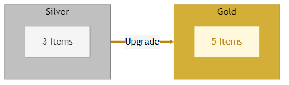

| Tier | Order Limit |
|------|-------------|
| **Silver** | 3 Items |
| **Gold** | 5 Items |

---

## 3. 핵심 기능

### 3.1 VIP 고객 플로우

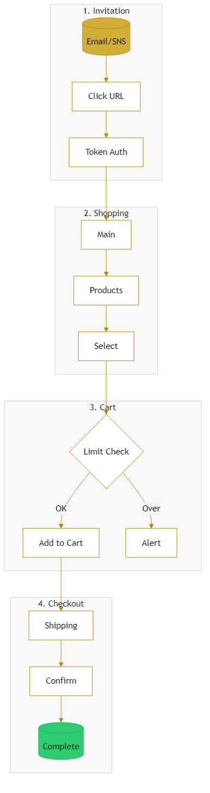

| 기능 | 우선순위 | 설명 |
|------|----------|------|
| 초대 링크 접근 | Critical | 고유 토큰 URL로만 접근 |
| 제품 탐색/선택 | Critical | 목록, 상세, 장바구니, 품절 표시 |
| 배송 정보 관리 | Critical | 저장된 배송 정보 표시/수정 |
| 주문 확정 | Critical | 확인 후 주문 완료 |

### 3.2 관리자 플로우

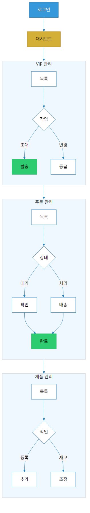

| 기능 | 우선순위 | 설명 |
|------|----------|------|
| VIP 초대 관리 | Critical | 초대, 링크 발송, 등급 변경 |
| 주문/배송 관리 | Critical | 목록, 상태 변경, 송장 입력 |
| 제품/재고 관리 | High | 등록/수정, 재고 조정 |
| 통계/리포트 | Medium | 대시보드, 차트, 활동 리포트 |

### 3.3 주문 상태 흐름

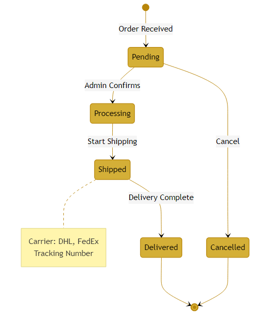

| Status | Description | Next Status |
|--------|-------------|-------------|
| **Pending** | Order received, awaiting review | Processing, Cancelled |
| **Processing** | Preparing items, hand over to carrier | Shipped, Cancelled |
| **Shipped** | In transit (DHL, FedEx, etc.) | Delivered |
| **Delivered** | Delivery complete | - |
| **Cancelled** | Order cancelled | - |

#### Carrier Information

When shipping starts, tracking number and carrier information (DHL, FedEx, etc.) are provided to customers.

---

## 4. 시스템 아키텍처

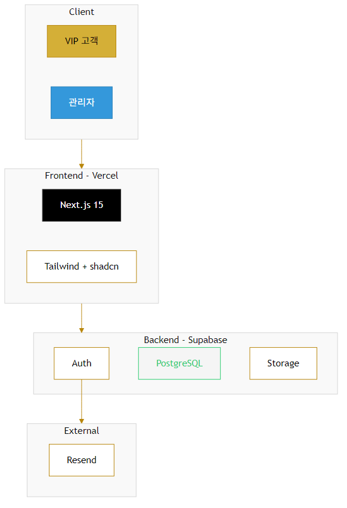

| 계층 | 기술 |
|------|------|
| **Frontend** | Next.js 15, Tailwind CSS, Framer Motion |
| **Backend** | Supabase (PostgreSQL, Auth, Storage) |
| **Email** | Resend |
| **Hosting** | Vercel + Supabase |

### 4.1 데이터베이스 스키마

Supabase PostgreSQL 기반의 데이터베이스 구조입니다.

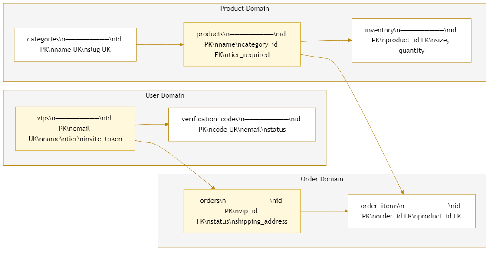

#### 테이블 설명

| 테이블 | 설명 | 주요 컬럼 |
|--------|------|----------|
| vips | VIP 고객 정보 | email, tier, reg_type, invite_token |
| verification_codes | QR 인증 코드 | code(6자리), status, approved_by |
| products | 상품 정보 | name, category_id, tier_required |
| categories | 상품 카테고리 | name, slug |
| inventory | 재고 관리 | product_id, size, quantity |
| orders | 주문 정보 | vip_id, status, shipping_address |
| order_items | 주문 상품 | order_id, product_id, size, quantity |

#### RLS 정책

| 테이블 | 정책 | 설명 |
|--------|------|------|
| vips | 자신의 데이터만 조회 | auth.uid() = id |
| verification_codes | 관리자만 승인 가능 | is_admin = true |
| products | 활성 상품만 조회 | is_active = true |
| orders | 자신의 주문만 조회 | vip_id = auth.uid() |
| inventory | 읽기 전용 | SELECT only |

---

## 5. UI 시안

### 5.1 제품 목록 페이지

VIP 고객이 초대 링크를 통해 바로 접근하는 메인 화면입니다. 별도 랜딩 페이지 없이 제품 목록으로 직접 연결됩니다.

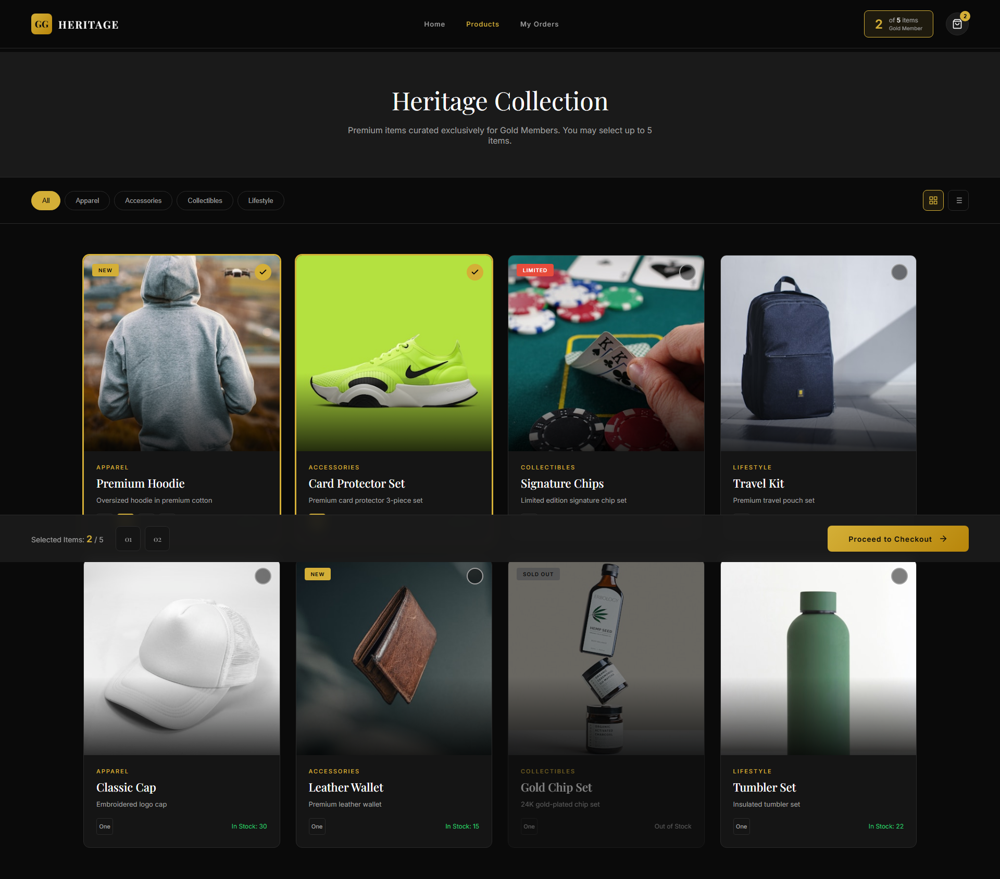

### 5.2 제품 상세 페이지

개별 제품의 상세 정보를 확인하는 화면입니다. 이미지 갤러리, 상품 정보, 사이즈 선택, 장바구니 추가 기능을 제공합니다.

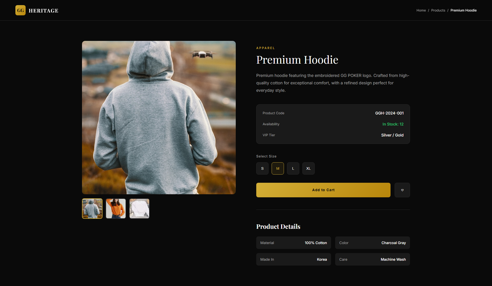

### 5.3 체크아웃

배송 정보를 확인하고 수정하는 화면입니다.

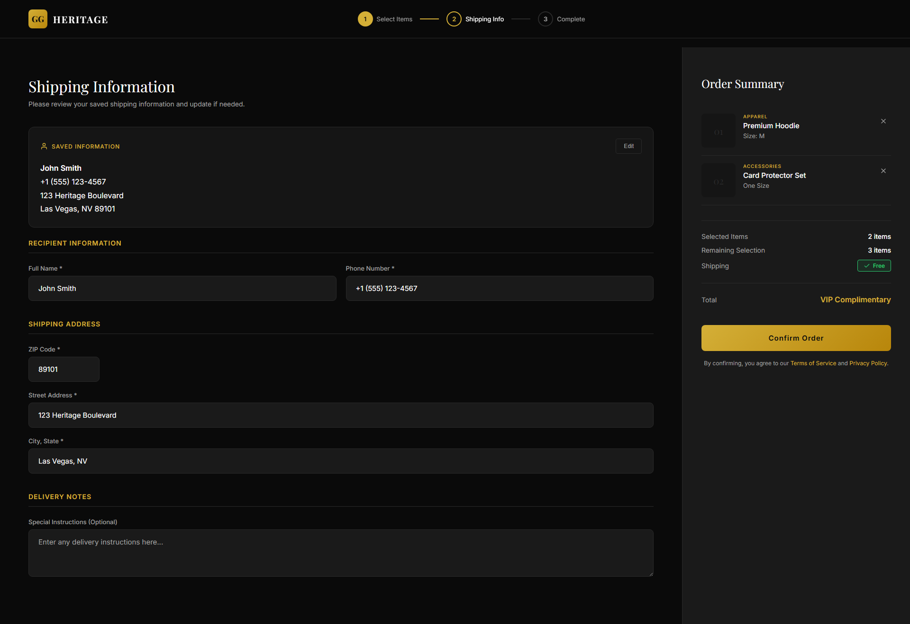

### 5.4 관리자 대시보드

관리자용 통합 대시보드입니다.

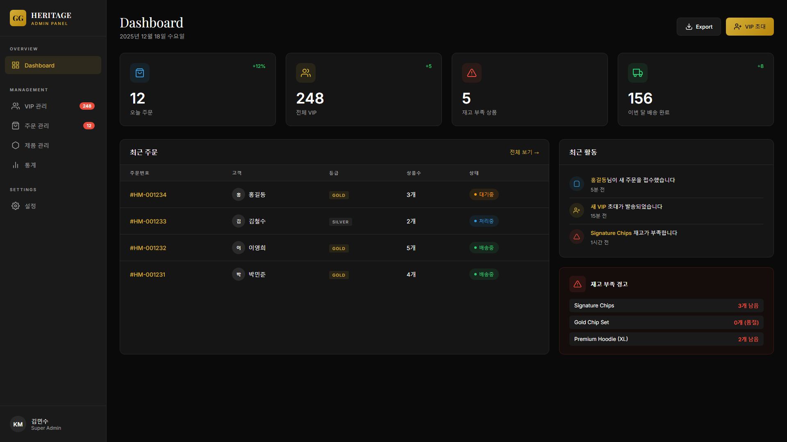

### 5.5 제품 추가 워크플로우

관리자가 새 제품을 등록하는 프로세스입니다.

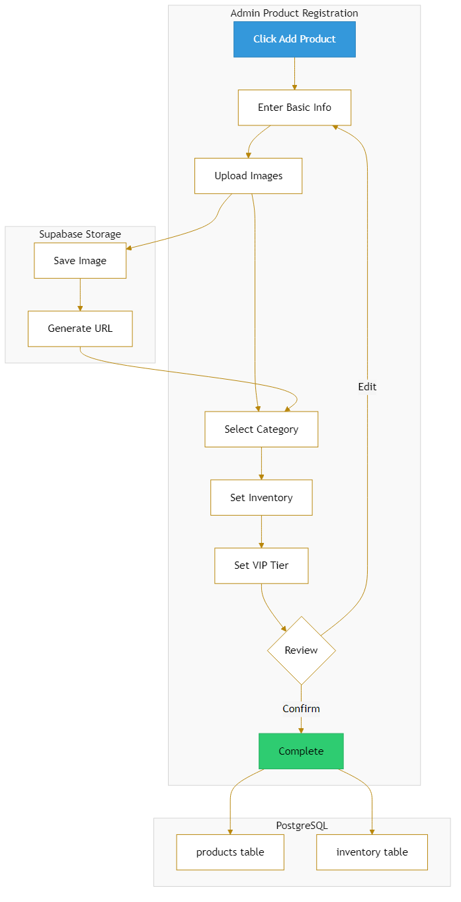

| 단계 | 항목 | 설명 |
|------|------|------|
| 1 | 기본 정보 | 상품명, 설명, 카테고리 |
| 2 | 이미지 업로드 | 상품 이미지 (최대 5장) |
| 3 | 재고 설정 | 사이즈별 재고 수량 |
| 4 | VIP 등급 설정 | Silver/Gold 구매 가능 여부 |
| 5 | 검토 및 등록 | 최종 확인 후 등록 |

### 5.6 제품 구매 워크플로우

VIP 고객이 제품을 구매하는 전체 프로세스입니다.

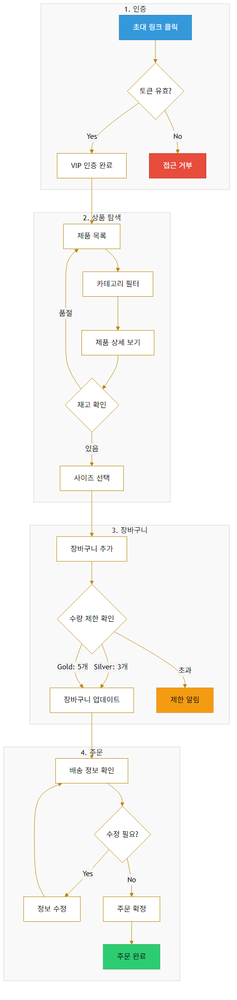

| 단계 | 프로세스 | 설명 |
|------|----------|------|
| 1. 인증 | 토큰 검증 | 초대 링크의 토큰 유효성 확인 |
| 2. 탐색 | 상품 브라우징 | 카테고리 필터, 재고 확인, 사이즈 선택 |
| 3. 장바구니 | 수량 제한 확인 | Silver 3개 / Gold 5개 제한 |
| 4. 주문 | 배송 정보 확인 | 주소 확인/수정 후 주문 확정 |

### 5.7 QR 코드 VIP 가입

QR 코드를 통한 VIP 가입 프로세스입니다. 이메일 초대와 달리 관리자 승인이 필요합니다.

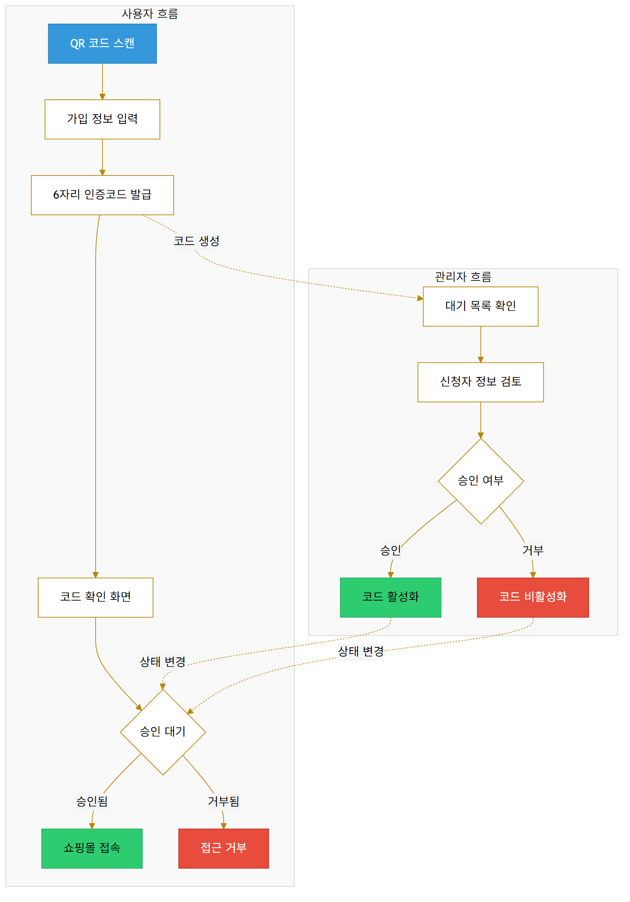

#### QR 가입 vs 이메일 초대 비교

| 구분 | 이메일 초대 | QR 코드 가입 |
|------|------------|--------------|
| 접근 방식 | 관리자가 직접 초대 | 사용자가 QR 스캔 |
| 인증 방식 | 토큰 링크 (자동 승인) | 6자리 코드 (관리자 승인) |
| 승인 절차 | 불필요 | 관리자 수동 승인 필요 |
| 보안 수준 | 높음 (지정된 이메일) | 중간 (코드 검증 필요) |

#### QR 가입 프로세스

| 단계 | 사용자 | 관리자 |
|------|--------|--------|
| 1 | QR 코드 스캔 | - |
| 2 | 가입 정보 입력 (이름, 이메일) | - |
| 3 | 6자리 인증코드 발급 | 대기 목록에 신청 표시 |
| 4 | 코드 확인 및 대기 | 신청자 정보 검토 |
| 5 | - | 승인 또는 거부 |
| 6 | 승인 시 쇼핑몰 접속 | - |

---

## 6. 디자인 컨셉

### Design Principles

| 원칙 | 설명 |
|------|------|
| **럭셔리** | 다크 모드 기반, 골드/블랙 컬러 |
| **미니멀** | 불필요한 요소 제거, 제품 중심 |
| **세련됨** | 부드러운 애니메이션, 정교한 타이포 |
| **은밀함** | 브랜드 최소화, 제품 경험 극대화 |

### Color Palette

| 색상 | 코드 | 용도 |
|------|------|------|
| **Primary** | `#D4AF37` | Gold (강조) |
| **Background** | `#0A0A0A` | Deep Black (배경) |
| **Surface** | `#1A1A1A` | Dark Gray (카드) |
| **Text** | `#FFFFFF` | White (텍스트) |
| **Accent** | `#B8860B` | Dark Gold (보조) |

### Typography

| 용도 | 폰트 | 스타일 |
|------|------|--------|
| **Heading** | Playfair Display | Serif, Elegant |
| **Body** | Inter | Sans-serif, Clean |

---

## 7. 보안 요구사항

### 인증/권한

| 영역 | 방식 | 설명 |
|------|------|------|
| VIP 접근 | Magic Link | 고유 초대 토큰 |
| 관리자 | Email + Password | Supabase Auth |
| API 보안 | Row Level Security | Supabase RLS |
| 토큰 만료 | 30일 | 만료 시 재발급 |

---

## 8. 성공 지표 (KPIs)

| 지표 | 목표 | 측정 방법 |
|------|------|----------|
| **주문 완료율** | 85%+ | 방문 VIP 중 주문 완료 |
| **페이지 로드** | < 2초 | Lighthouse |
| **관리 효율** | 주문당 5분 | 처리 시간 |
| **가용성** | 99.9% | 모니터링 |

---

## 9. 리스크 및 대응

| 리스크 | 확률 | 영향 | 대응 |
|--------|------|------|------|
| 토큰 유출 | 중 | 고 | 1인 1토큰, IP 추적 |
| 트래픽 급증 | 저 | 중 | Edge 스케일링 |
| 이미지 지연 | 중 | 중 | CDN, 레이지 로딩 |
| 재고 동시성 | 중 | 고 | 트랜잭션 |

---

## Document History

| 버전 | 날짜 | 변경 내용 | 작성자 |
|------|------|----------|--------|
| 1.0 | 2025-12-18 | 초안 작성 | Claude |
| 2.0 | 2025-12-18 | Mermaid 다이어그램, UI 시안 추가 | Claude |
| 3.0 | 2025-12-18 | Google Docs 동기화 (QR 가입, DB 스키마, 구조 변경) | Claude |

---

## 관련 파일

### 다이어그램

| 파일 | 설명 |
|------|------|
| `design/diagrams/01-vip-user-flow.png` | VIP 사용자 플로우 |
| `design/diagrams/02-order-state.png` | 주문 상태 흐름 |
| `design/diagrams/03-system-architecture.png` | 시스템 아키텍처 |
| `design/diagrams/04-vip-tier.png` | VIP 등급 체계 |
| `design/diagrams/05-admin-flow.png` | 관리자 플로우 |
| `design/diagrams/07-product-add-flow.png` | 제품 추가 워크플로우 |
| `design/diagrams/08-db-schema.png` | 데이터베이스 스키마 |
| `design/diagrams/09-purchase-flow.png` | 제품 구매 워크플로우 |
| `design/diagrams/10-qr-registration-flow.png` | QR 코드 VIP 가입 |

### UI 시안

| 파일 | 설명 |
|------|------|
| `design/screenshots/02-product-list.png` | 제품 목록 |
| `design/screenshots/03-checkout.png` | 체크아웃 |
| `design/screenshots/04-admin-dashboard.png` | 관리자 대시보드 |
| `design/screenshots/05-product-detail.png` | 제품 상세 |

### HTML 원본

| 파일 | 설명 |
|------|------|
| `design/mockups/02-product-list.html` | 제품 목록 HTML |
| `design/mockups/03-checkout.html` | 체크아웃 HTML |
| `design/mockups/04-admin-dashboard.html` | 관리자 대시보드 HTML |
| `design/mockups/05-product-detail.html` | 제품 상세 HTML |
